<p align="center">
  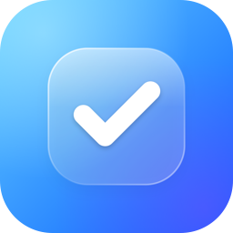
</p>

<h1 align="center">Tik</h1>

<p align="center">
  A minimal, glassy to-do app for iPhone and iPad.<br>
  Built with SwiftUI, SwiftData and Liquid Glass for iOS 27.
</p>

<p align="center">
  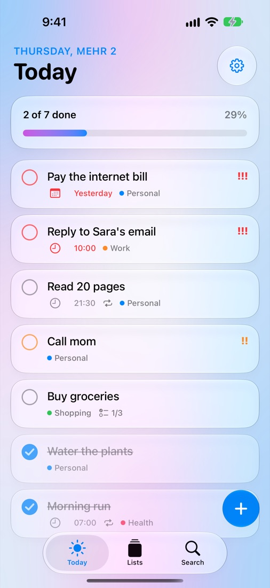
  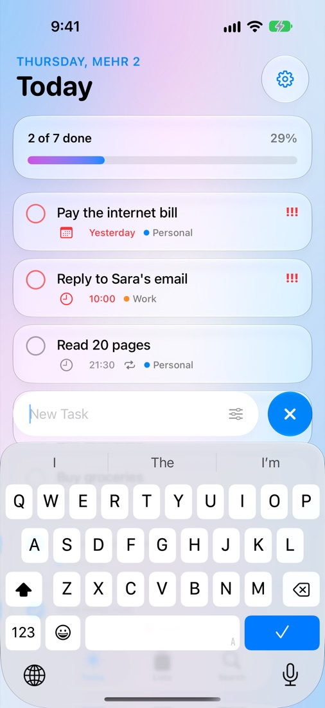
  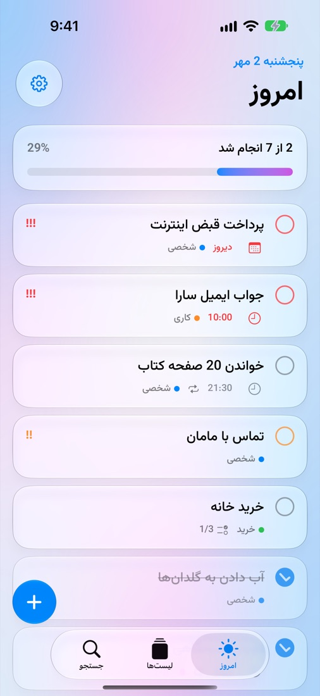
</p>

## Features

- **Today** — what is due today and anything that is late, with a progress bar. Done tasks slide to the bottom, and the last one of the day gets a burst of confetti.
- **Quick add** — the glass **+** button melts into a text field (a Liquid Glass morph). It stays open after each task, so a whole day can be typed in one go.
- **Lists** — an Inbox and your own lists with a color and an icon, plus smart lists: Today, Scheduled, All and Completed.
- **Task details** — notes, subtasks, a day and a time, priority, a photo, and repeats: every day, certain weekdays, every few days, every week, month or year. Ticking a repeating task adds the next one on the right day.
- **Reminders** — local notifications with **Mark as Done** and **Remind Me in 10 Minutes** buttons that work without opening the app, and an optional count on the app icon.
- **Widgets** — small, medium and large Home Screen widgets and three Lock Screen widgets. Tasks can be ticked right on the widget.
- **English and فارسی** — switch the language inside the app, whatever the phone's language is. Farsi is fully right-to-left, with the Vazirmatn font.
- **Shamsi or Gregorian calendar** — Shamsi is the default, weeks start on Saturday, and numbers always use English digits.
- **Make it yours** — light, dark or system theme, 11 accent colors, 6 app icons, haptics, sounds, how Today is sorted, and any task detail you don't use can be turned off.
- **iPhone and iPad** — tabs on iPhone, a sidebar with search on iPad.

## Screenshots

**Light**

<p align="center">
  
  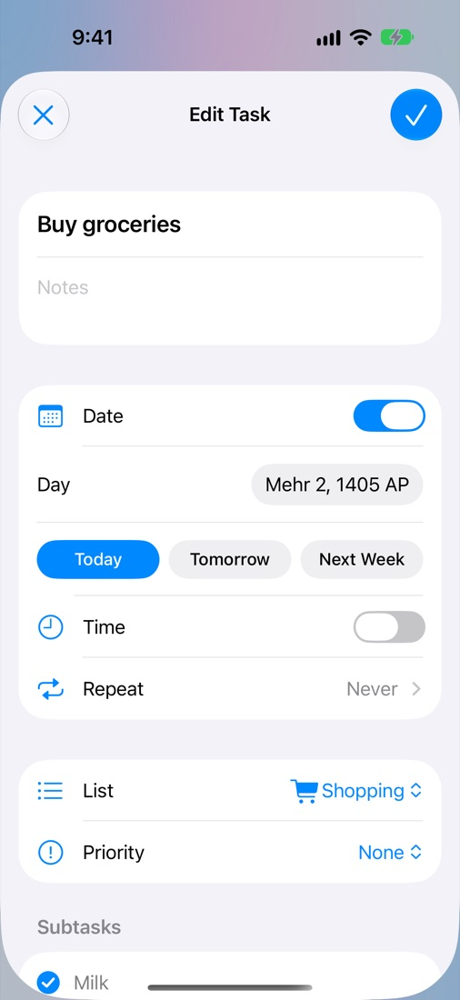
  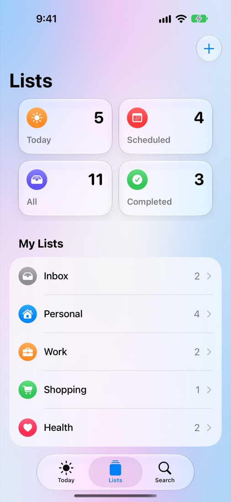
  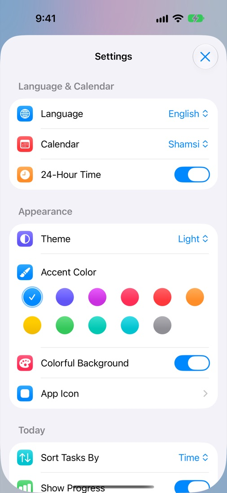
</p>

**Dark**

<p align="center">
  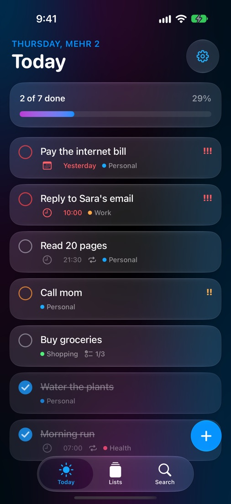
  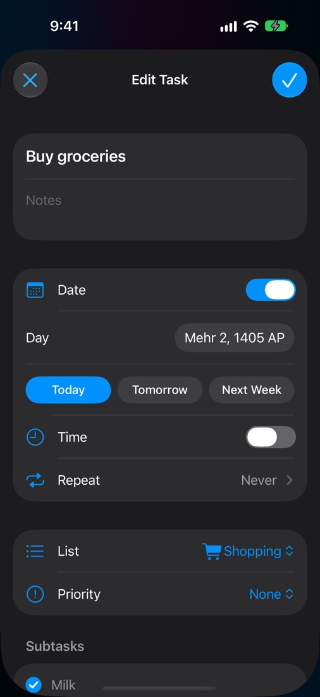
  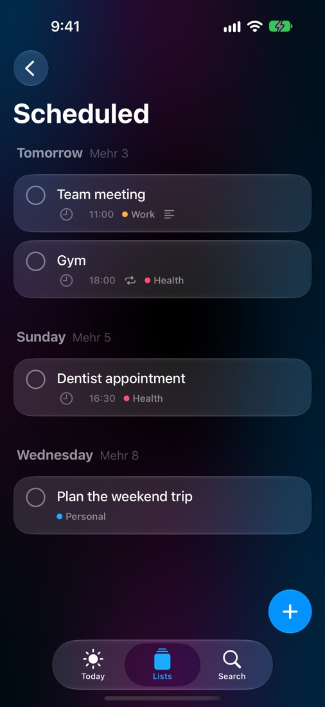
  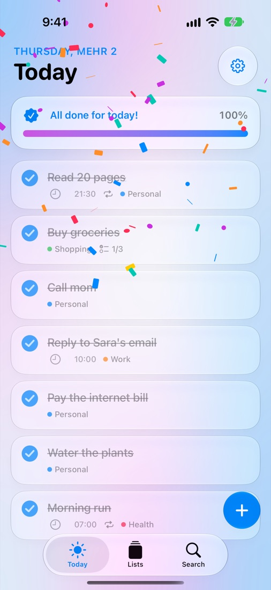
</p>

**فارسی**

<p align="center">
  
  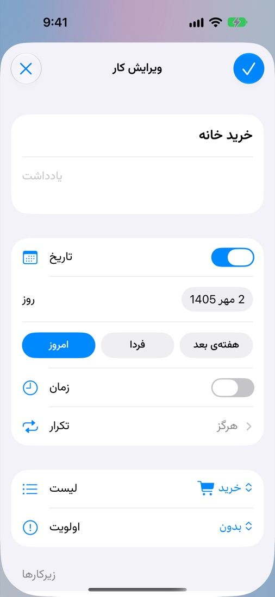
  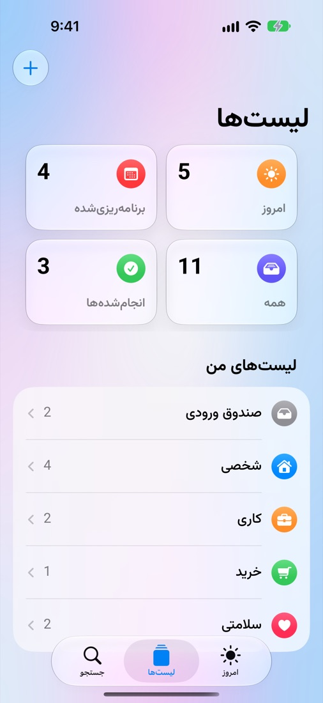
  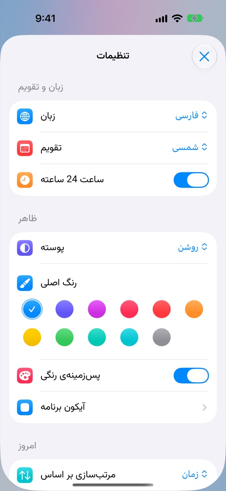
</p>

**Widgets and iPad**

<p align="center">
  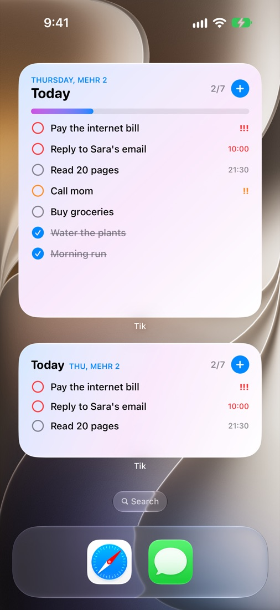
  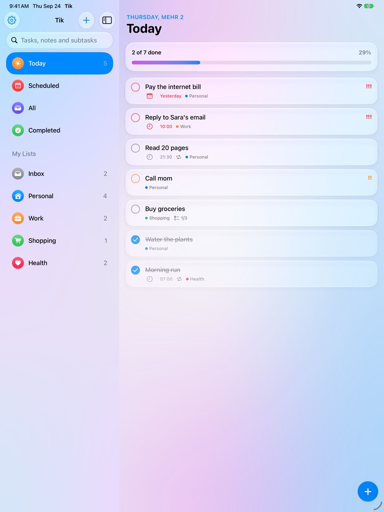
</p>

## How it's built

| | |
| --- | --- |
| UI | SwiftUI for iOS 27: `glassEffect`, `GlassEffectContainer` morphs, glass buttons, `safeAreaBar`, `MeshGradient` |
| Data | SwiftData, stored in an App Group so the widget reads and writes the same tasks |
| Widgets | WidgetKit, with an App Intent for ticking tasks on the widget |
| Reminders | UserNotifications with actions and the app badge |
| Languages | A String Catalog with English and Farsi, switched from inside the app through the `locale` and `layoutDirection` environment values |
| Tests | 35 unit tests with Swift Testing, 18 UI tests with XCTest |
| Project | Generated from `project.yml` with [XcodeGen](https://github.com/yonaskolb/XcodeGen) |

The app icons are drawn in code by `Scripts/make-icons.swift`, and the two sounds are made from math by `Scripts/make-sounds.py`.

```
Tik/          The app: screens, settings, reminders, sounds
Shared/       Code the app and the widget both use: models, logic, date formatting, fonts, strings
TikWidget/    Home Screen and Lock Screen widgets
TikTests/     Unit tests (Swift Testing)
TikUITests/   UI tests, including the one that takes these screenshots
Scripts/      Draws the app icons and makes the sounds
```

## Run it on your own iPhone for free

You don't need the paid Apple Developer Program to use Tik on your own devices.

1. Install **Xcode 27**, clone this repo, and open `Tik.xcodeproj`.
2. In Xcode, go to **Settings → Accounts** and sign in with your Apple ID.
3. Select the **Tik** target, open **Signing & Capabilities**, and pick your **Personal Team**. Do the same for the **TikWidget** target.
4. Plug in your iPhone, turn on **Developer Mode** (Settings → Privacy & Security → Developer Mode), pick your phone at the top of Xcode, and press **Run**.
5. The first time, trust the app on the phone: Settings → General → VPN & Device Management.

With a free account the app keeps working for 7 days. After that, plug the phone in and press Run again; your tasks stay where they are.

> **If Xcode complains about the bundle ID or the App Group**, change `com.mahyarmozafar` in `project.yml` to something of your own and run `xcodegen`. If your team can't use App Groups at all, remove the capability from both targets: the app keeps working, only the widget won't see your tasks.

## Tests

```sh
xcodebuild test -project Tik.xcodeproj -scheme Tik \
  -destination 'platform=iOS Simulator,name=iPhone 18 Pro'
```

- `ScreenshotTests` take the pictures above when `TEST_RUNNER_SCREENSHOTS_DIR=<folder>` is set.
- `WidgetTests` add the widgets to the simulator's Home Screen, so they only run with `TEST_RUNNER_RUN_WIDGET_TESTS=1`.
- Debug builds accept `-demo` (fill the app with example tasks), `-lang fa` and `-theme dark`.

## License

MIT — see [LICENSE](LICENSE).
The Vazirmatn font is by Saber Rastikerdar, under the SIL Open Font License.
